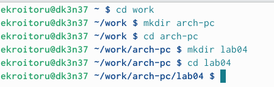
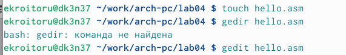
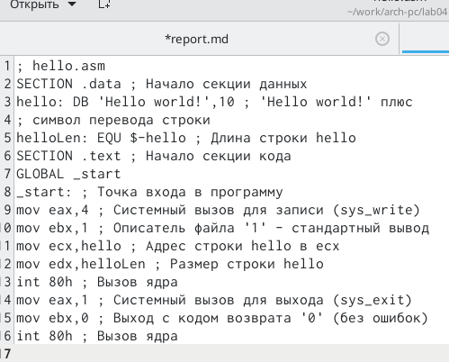
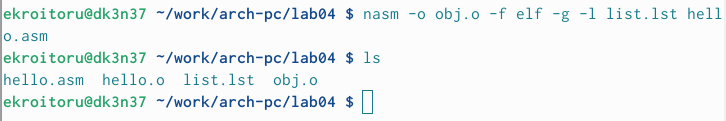
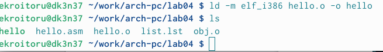
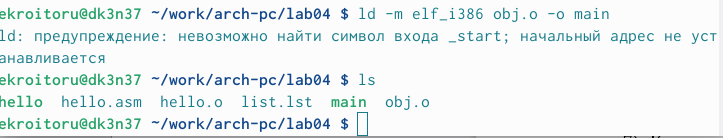
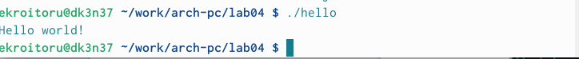

---
## Front matter
title: "Oтчёт по лабораторной работе №4"
subtitle: "Архитектура вычеслительных систем"
author: "Кроитору Екатерина"

## Generic otions
lang: ru-RU
toc-title: "Содержание"

## Bibliography
bibliography: bib/cite.bib
csl: pandoc/csl/gost-r-7-0-5-2008-numeric.csl

## Pdf output format
toc: true # Table of contents
toc-depth: 2
lof: true # List of figures
lot: true # List of tables
fontsize: 12pt
linestretch: 1.5
papersize: a4
documentclass: scrreprt
## I18n polyglossia
polyglossia-lang:
  name: russian
  options:
	- spelling=modern
	- babelshorthands=true
polyglossia-otherlangs:
  name: english
## I18n babel
babel-lang: russian
babel-otherlangs: english
## Fonts
mainfont: PT Serif
romanfont: PT Serif
sansfont: PT Sans
monofont: PT Mono
mainfontoptions: Ligatures=TeX
romanfontoptions: Ligatures=TeX
sansfontoptions: Ligatures=TeX,Scale=MatchLowercase
monofontoptions: Scale=MatchLowercase,Scale=0.9
## Biblatex
biblatex: true
biblio-style: "gost-numeric"
biblatexoptions:
  - parentracker=true
  - backend=biber
  - hyperref=auto
  - language=auto
  - autolang=other*
  - citestyle=gost-numeric
## Pandoc-crossref LaTeX customization
figureTitle: "Рис."
tableTitle: "Таблица"
listingTitle: "Листинг"
lofTitle: "Список иллюстраций"
lotTitle: "Список таблиц"
lolTitle: "Листинги"
## Misc options
indent: true
header-includes:
  - \usepackage{indentfirst}
  - \usepackage{float} # keep figures where there are in the text
  - \floatplacement{figure}{H} # keep figures where there are in the text
---

# Цель работы

Освоение процедуры компиляции и сборки программ, написанных на ассем-
блере NASM.

# Задание

1. В соответствующем каталоге сделайте отчёт по лабораторной работе No4 в
формате Markdown. В качестве отчёта необходимо предоставить отчёты в 3
форматах: pdf, docx и md.
2. Загрузите файлы на github.

# Теоретическое введение

Здесь описываются теоретические аспекты, связанные с выполнением работы.

Например, в табл. [-@tbl:std-dir] приведено краткое описание стандартных каталогов Unix.

: Описание некоторых каталогов файловой системы GNU Linux {#tbl:std-dir}

| Имя каталога | Описание каталога                                                                                                          |
|--------------|----------------------------------------------------------------------------------------------------------------------------|
| `/`          | Корневая директория, содержащая всю файловую                                                                               |
| `/bin `      | Основные системные утилиты, необходимые как в однопользовательском режиме, так и при обычной работе всем пользователям     |
| `/etc`       | Общесистемные конфигурационные файлы и файлы конфигурации установленных программ                                           |
| `/home`      | Содержит домашние директории пользователей, которые, в свою очередь, содержат персональные настройки и данные пользователя |
| `/media`     | Точки монтирования для сменных носителей                                                                                   |
| `/root`      | Домашняя директория пользователя  `root`                                                                                   |
| `/tmp`       | Временные файлы                                                                                                            |
| `/usr`       | Вторичная иерархия для данных пользователя                                                                                 |

Более подробно об Unix см. в [@gnu-doc:bash;@newham:2005:bash;@zarrelli:2017:bash;@robbins:2013:bash;@tannenbaum:arch-pc:ru;@tannenbaum:modern-os:ru].

# Выполнение лабораторной работы

1) Создаём каталог для работы с программами на языке ассемблера NASM (рис. [-@fig:001])

{ #fig:001 width=70% }
2) Создаём текстовый файл с именем hello.asm и открываем этот файл с помо-
щью любого текстового редактора gedit: (рис. [-@fig:002])

{ #fig:002 width=70% }
3) водим в него следующий текст: (рис. [-@fig:003])

{ #fig:003 width=70% }
4) NASM превращает текст программы в объектный код. Например, для компи-
ляции приведённого выше текста программы «Hello World» необходимо написать
следующее (рис. [-@fig:004]) 
Т. к. текст программы набран без ошибок, транслятор преобразует текст про-
граммы из файла hello.asm в объектный код, который записан в файл hello.o.

{ #fig:004 width=70% }
5) С помощью команды ls проверим, что объектный файл был создан. У нас
есть два файла hello.asm и hello.o.
Следующая команда скомпилирует исходный файл hello.asm в obj.o , при этом
формат выходного файла будет elf, и в него будут включены символы для отладки
(опция -g), кроме того, создается файл листинга list.lst .Выполним следующую
команду: (рис. [-@fig:005])

{ #fig:005 width=70% }
6) Чтобы получить исполняемую программу, объектный файл необходимо пе-
редать на обработку компоновщику, а потом с командой ls проверим содержи-
мое: (рис. [-@fig:006])

{ #fig:006 width=70% }
7) Ключ -o с последующим значением задаст в данном случае имя создавае-
мого исполняемого файла. Выполним следующую команду
Чтобы получить исполняемую программу, объектный файл необходимо пере-
дать на обработку компоновщику, а потом с командой ls проверим содержимое: (рис. [-@fig:007])

{ #fig:007 width=70% }
8) Запустим на выполнение созданный исполняемый файл, находящийся в
текущем каталоге, набрав в командной строке ./hello: (рис. [-@fig:008])

{ #fig:008 width=70% }

# Выполнение самостоятельной работы 
1) В каталоге ~/work/arch-pc/lab04 с помощью команды cp создали копию
файла hello.asm с именем lab04.asm. (рис. [-@fig:009]) 

{ #fig:009 width=70% }
2) С помощью текстового редактора вносим изменения в текст программы в
файле lab04.asm так, чтобы вместо Hello world! на экран выводилась строка с
фамилией и именем. Для этого вместо “Hello world” пишем своё имя. (рис. [-@fig:010])

{ #fig:010 width=70% }
3) Проводим схожие действия с лабораторной работой, но изменяем название
файлов. (рис. [-@fig:011])

{ #fig:011 width=70% }
4) Оттранслируем полученный текст программы lab04.asm в объектный файл
и запустим, получим вывод фамилии и имени. (рис. [-@fig:012])

{ #fig:012 width=70% }
5) Переносим файлы в основную папку lab04: (рис. [-@fig:013])

{ #fig:013 width=70% }
6) Загружаем файлы на GitHub при помощи команд. (рис. [-@fig:014])

{ #fig:014 width=70% }

# Выводы

Я освоил процедуру компиляции и сборки программ, написанных на ассембле-
ре NASM.

# Список литературы{.unnumbered}

::: {#
1. GNU Bash Manual [Электронный ресурс]. Free Software Foundation, 2016.
URL: https://www.gnu.org/software/bash/manual/.
2. Newham C. Learning the bash Shell: Unix Shell Programming. O’Reilly Media,
2005. 354 с.
3. Zarrelli G. Mastering Bash. Packt Publishing, 2017. 502 с.
4. Robbins A. Bash Pocket Reference. O’Reilly Media, 2016. 156 с.
5. Таненбаум Э. Архитектура компьютера. 6-е изд. СПб.: Питер, 2013. 874 с.
6. Таненбаум Э., Бос Х. Современные операционные системы. 4-е изд. СПб.:
Питер, 2015. 1120 с.}
:::
