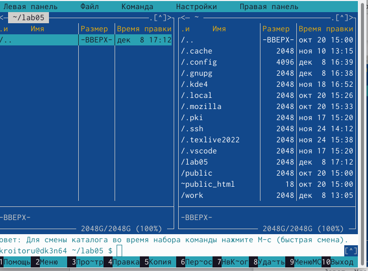
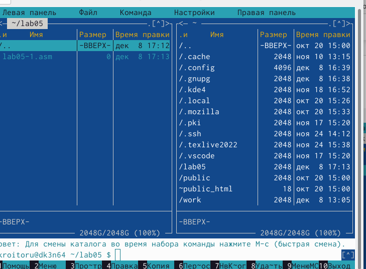
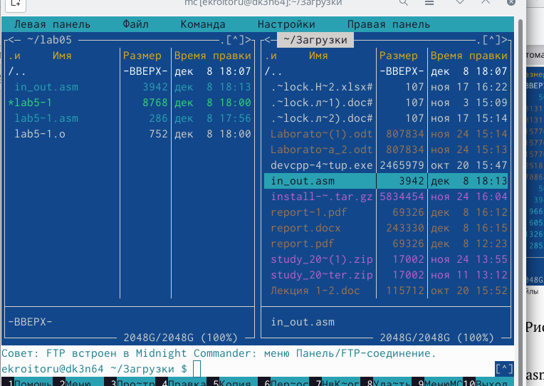
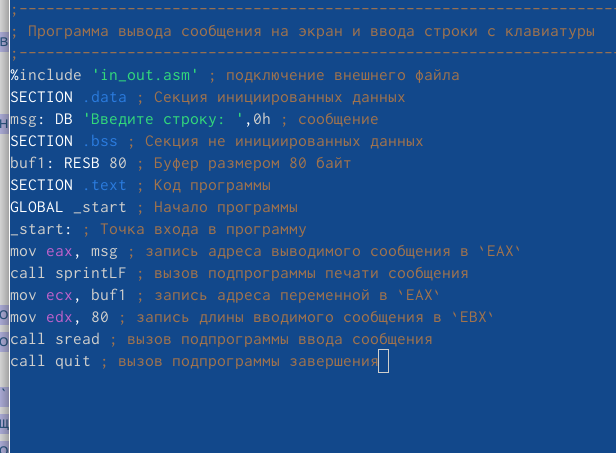

---
## Front matter
title: "Отчёт по лабораторной работе №5"
subtitle: "Архитектура компьютера"
author: "Кроитору Екатерина"

## Generic otions
lang: ru-RU
toc-title: "Содержание"

## Bibliography
bibliography: bib/cite.bib
csl: pandoc/csl/gost-r-7-0-5-2008-numeric.csl

## Pdf output format
toc: true # Table of contents
toc-depth: 2
lof: true # List of figures
lot: true # List of tables
fontsize: 12pt
linestretch: 1.5
papersize: a4
documentclass: scrreprt
## I18n polyglossia
polyglossia-lang:
  name: russian
  options:
	- spelling=modern
	- babelshorthands=true
polyglossia-otherlangs:
  name: english
## I18n babel
babel-lang: russian
babel-otherlangs: english
## Fonts
mainfont: PT Serif
romanfont: PT Serif
sansfont: PT Sans
monofont: PT Mono
mainfontoptions: Ligatures=TeX
romanfontoptions: Ligatures=TeX
sansfontoptions: Ligatures=TeX,Scale=MatchLowercase
monofontoptions: Scale=MatchLowercase,Scale=0.9
## Biblatex
biblatex: true
biblio-style: "gost-numeric"
biblatexoptions:
  - parentracker=true
  - backend=biber
  - hyperref=auto
  - language=auto
  - autolang=other*
  - citestyle=gost-numeric
## Pandoc-crossref LaTeX customizationSize
figureTitle: "Рис."
tableTitle: "Таблица"
listingTitle: "Листинг"
lofTitle: "Список иллюстраций"
lotTitle: "Список таблиц"
lolTitle: "Листинги"
## Misc options
indent: true
header-includes:
  - \usepackage{indentfirst}
  - \usepackage{float} # keep figures where there are in the text
  - \floatplacement{figure}{H} # keep figures where there are in the text
---

# Цель работы

Приобретение практических навыков работы в Midnight Commander. Освоение
инструкций языка ассемблера mov и int.

# Задание

1. Создайте копию файла lab6-1.asm. Внесите изменения в программу (без
использования внешнего файла in_out.asm), так чтобы она работала по
следующему алгоритму: • вывести приглашение типа “Введите строку:”; •
ввести строку с клавиатуры; • вывести введённую строку на экран.
2. Получите исполняемый файл и проверьте его работу. На приглашение вве-
сти строку введите свою фамилию.
3. Создайте копию файла lab6-2.asm. Исправьте текст программы с использо-
вание подпрограмм из внешнего файла in_out.asm, так чтобы она работала
по следующему алгоритму:
• вывести приглашение типа “Введите строку:”;
• ввести строку с клавиатуры;
• вывести введённую строку на экран.

# Теоретическое введение
Midnight Commander (или просто mc) — это программа, которая позволяет
просматривать структуру каталогов и выполнять основные операции по управ-
лению файловой системой, т.е. mc является файловым менеджером. Midnight
Commander позволяет сделать работу с файлами более удобной и наглядной. Для
активации оболочки Midnight Commander достаточно ввести в командной строке
mc и нажать клавишу Enter.В Midnight Commander используются функциональ-
ные клавиши F1 — F10 ,которым привязаны часто выполняемые операции.

# Выполнение лабораторной работы

С помощью команды mc откроем Midnight Commander.  (рис. [-@fig:001])

{ #fig:001 width=70% }

С помощью функциональной клавиши F7 создаем папку lab05 и переходим в
созданный каталог. ( (рис. [-@fig:002])

{ #fig:002 width=70% }
Пользуясь строкой ввода и командой touch создаем файл lab5-1.asm.  (рис. [-@fig:003])

{ #fig:003 width=70% }
С помощью функциональной клавиши F4 откроем файл lab5-1.asm для редак-
тирования во встроенном редакторе. Вводим текст программы из листинга.  (рис. [-@fig:004])

{ #fig:004 width=70% }
Оттранслируем текст программы lab5-1.asm в объектный файл. Выполним
компоновку объектного файла и запустим получившийся исполняемый файл.
Программа выводит строку ‘Введите строку:’ и ожидает ввода с клавиатуры. На
запрос ввожу свои ФИО. (рис. [-@fig:005])

{ #fig:005 width=70% }
В одной из панелей mc откроем каталог с файлом lab5-1.asm. В другой панели
каталог со скаченным файлом in_out.asm.  (рис. [-@fig:006])

{ #fig:006 width=70% }
Скопируем файл in_out.asm в каталог с файлом lab5-1.asm с помощью функци-
ональной клавиши F5.  (рис. [-@fig:007])

{ #fig:008 width=70% }
# Самостоятельная работа
5 Самостоятельная работа
Создаем копию файла lab5-1.asm. (рис. [-@fig:009])

{ #fig:009 width=70% }
Внесем изменения в программу (без использования внешнего файла
in_out.asm), так чтобы она работала по следующему алгоритму:
• вывести приглашение типа “Введите строку:”;
• ввести строку с клавиатуры;
• вывести введённую строку на экран.  (рис. [-@fig:010])

{ #fig:010 width=70% }
Запустим исполняемый файл lab5-1. (рис. [-@fig:011])

{ #fig:011 width=70% }оздаем копию файла lab5-2.asm. (рис. [-@fig:012])

{ #fig:012 width=70% }
Исправим текст программы с использованием подпрограмм из внешнего фай-
ла in_out.asm, так чтобы она работала по следующему алгоритму:
• вывести приглашение типа “Введите строку:”;
• ввести строку с клавиатуры;
• вывести введённую строку на экран. (рис. [-@fig:013])

{ #fig:013 width=70% }
Запустим исполняемый файл lab5-2.  (рис. [-@fig:014])

{ #fig:014 width=70% }

# Выводы
Я приобрела практические навыки работы в Midnight Commander, освоила
инструкции языка ассемблера mov и int.
# Список литературы{.unnumbered}

::: {#refs}
:::
